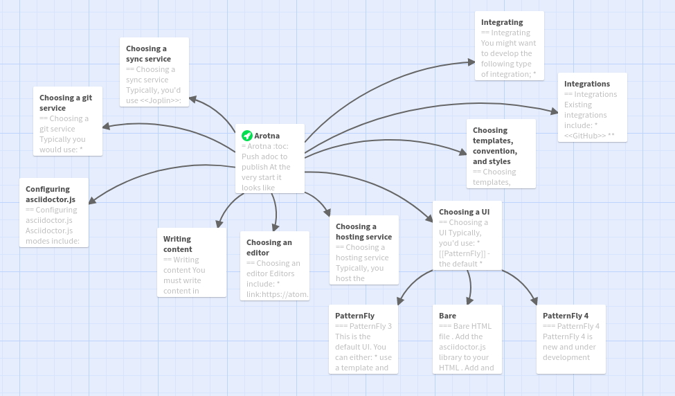

include::attributes.adoc[]

[id='about-arotna']
= About Arotna
:context: about

Arotna helps you write and publish asciidoc documentation with ease.

.Prerequisites

* you are familiar with markup languages
* you need to publish text and graphics
* you need to work fast

== Additional resources

* link:{PREFIX}assembly_using.adoc[Using arotna]
* For more details on writing assemblies, see the link:https://github.com/redhat-documentation/modular-docs#modular-documentation-reference-guide[Modular Documentation Reference Guide].
* Use a consistent system for file names, IDs, and titles. For tips, see _Anchor Names and File Names_ in link:https://github.com/redhat-documentation/modular-docs#modular-documentation-reference-guide[Modular Documentation Reference Guide].

